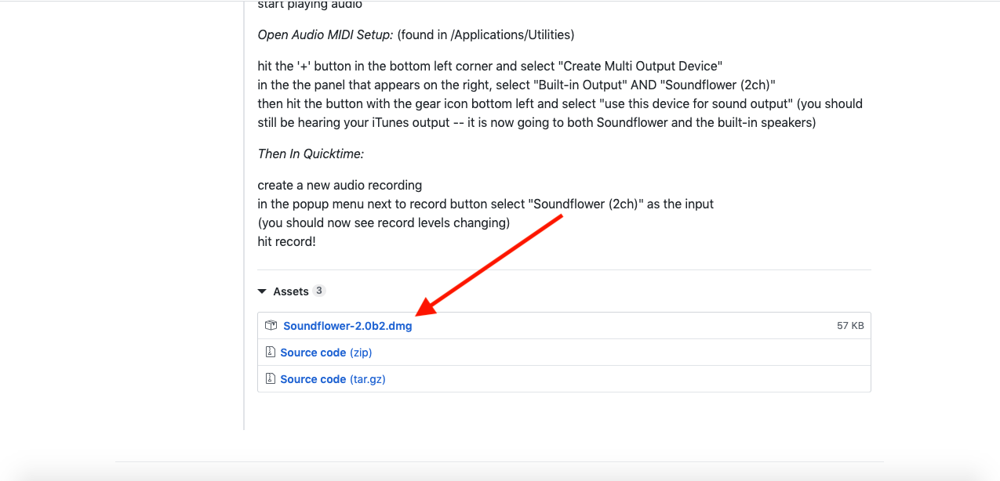
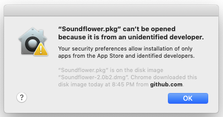
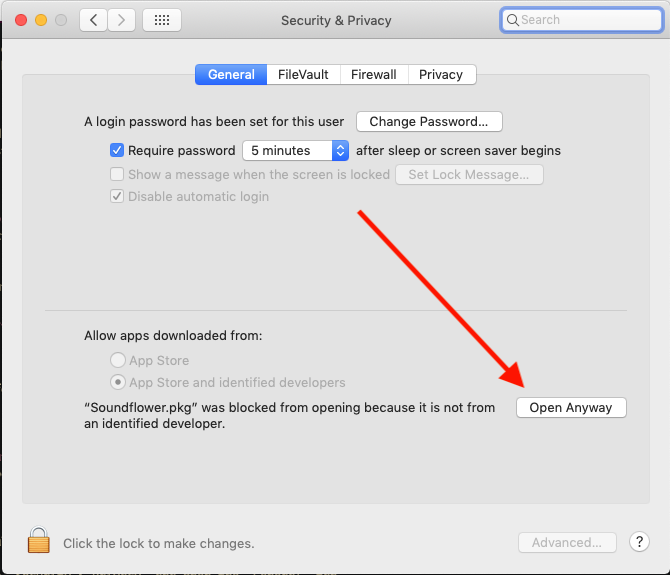
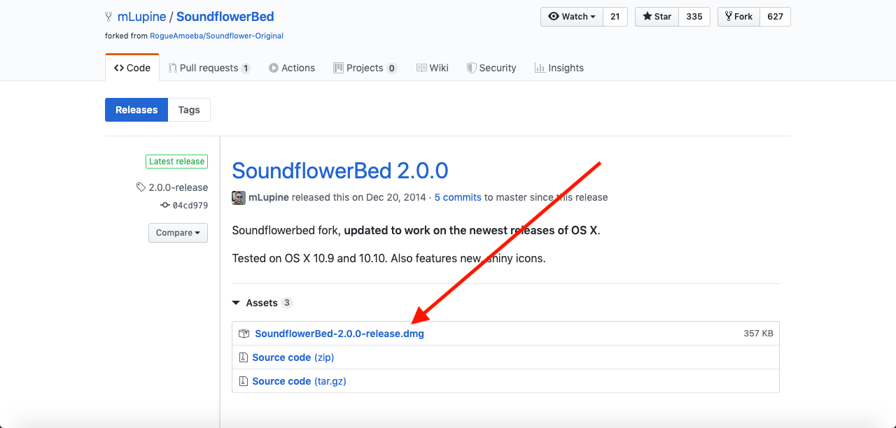
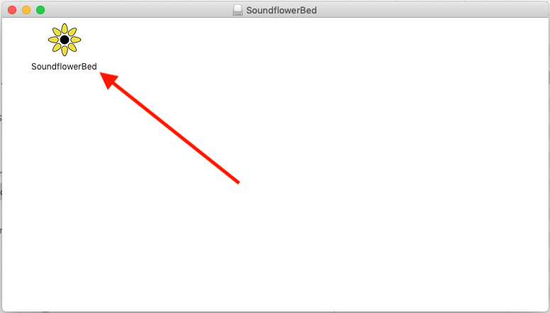
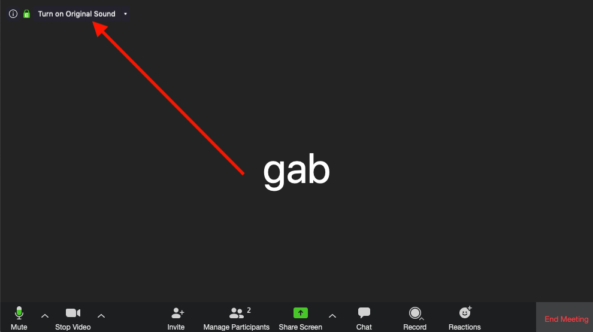
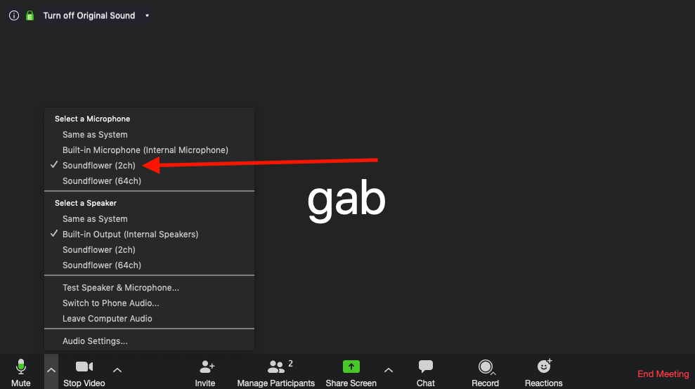
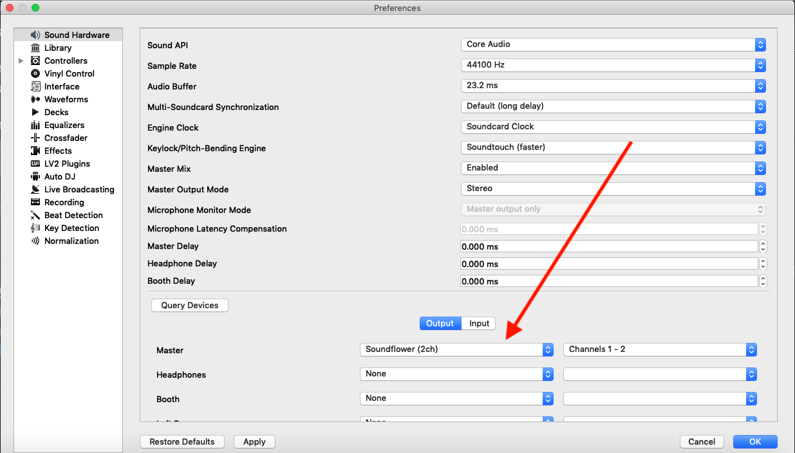
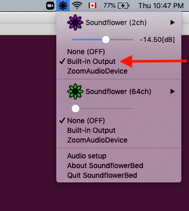

# Stream Resources
This is a guide for setting up everything needed to stream audio on Mac.
It is mainly intended for streaming live DJ sets through Zoom, but it should
be compatible with any streaming purposes or apps.

## Zoom
Zoom is a useful app for video conferencing and can be modified to stream
audio with (almost) original quality. Follow these steps to install Zoom
and configure it for audio streaming.

#### Install Zoom
First download the Zoom installer from the [official site](https://zoom.us/download).
Once the file is downloaded, click on it and follow the instructions to install the Zoom app.

#### Configure Zoom to Use Original Sound
Normally Zoom applies some noise cancellation to your audio, but when streaming
we want to preserve our computer's original audio.
Follow the instructions [here](https://support.zoom.us/hc/en-us/articles/115003279466-Enabling-option-to-preserve-original-sound)
to enable original sound. Use the instructions under the "User" section.

## Soundflower
Mac does not let you stream audio directly to other apps by default, so we will
use a free application called Soundflower.

#### Install Soundflower
Soundflower can be quite annoying to install so follow these instructions carefully if you encounter any errors.

Download the Soundflower installer [here](https://github.com/mattingalls/Soundflower/releases/tag/2.0b2).
Scroll down to the bottom of the page and click on the file labeled `Soundflower-2.0b2.dmg`.

Click on the file once it is downloaded.
Click on `Soundflower.pkg` to run the installer.

You may get a security warning like this when running the installer.

If you do, close the warning, open System Preferences, click on "Security & Privacy" and open the "General" tab.
There should be a notice at the bottom saying that `Soundflower.pkg` was blocked from running, click "Open Anyway"

Follow the steps in the Soundflower installer.

The installation may fail the first time. If it does don't panic! Do not close the installer!
Close System Preferences and re-open it, and navigate back to "Security & Privacy."
There should be a notice on the bottom to allow the Soundflower installer to run. Click "allow".

Now you can close the installer and re-run it, and this time the installation should complete succesfully.

#### Install SoundflowerBed (optional)
SoundflowerBed is an app to help manage Soundflower. It makes it easier to monitor and control your audio while streaming, so I recommend it.

Download  SoundflowerBed [here](https://github.com/mLupine/SoundflowerBed/releases).
Click on the file labeled `SoundflowerBed-2.0.0-release.dmg` and open it when it's finished downloading.

Click on the app to run it.

(**Note:** You should copy the SoundflowerBed app to your `Applications/` folder so you can easily run it again in the future)

## Putting It All Together -- Streaming
You now have all the tools necessary to stream audio to a Zoom call!

First open Zoom and join or start a meeting. 

In the zoom client make sure to click "Turn on Original Sound" (you should have set this up in the earlier section).

Click on the arrow next to the microphone in the bottom corner of zoom, and under "Select a Microphone" choose "Soundflower (2ch)"

Now, in your preferred DJ / Audio software, open your audio preferences and select your output device as "Soundflower (2ch)"
Here is an example in Mixxx DJ software.

Congrats, you're now streaming audio to zoom!

You might notice you can't hear the audio on your own computer.
It's ok, when you opened SoundflowerBed it should have created a flower icon in the top right corner of your screen.
Click the icon to open the menu, and under "Soundflower (2ch)" select "Built-in Output." You should now hear the audio being streamed to zoom :)

